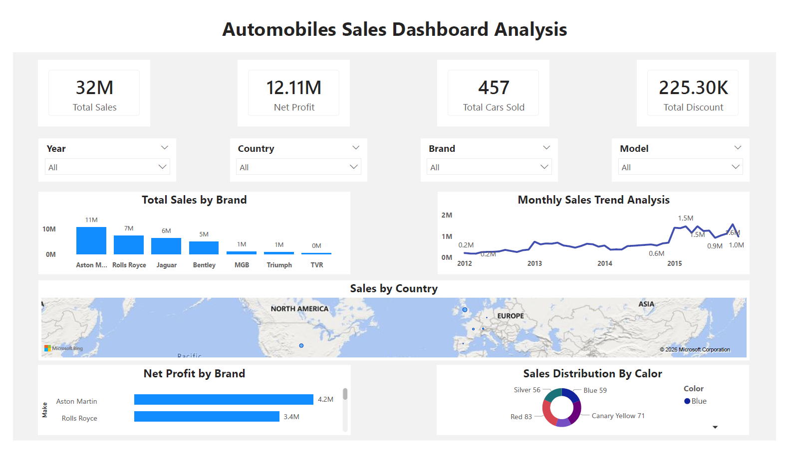

# Automobile Sales Dashboard (Power BI)

## 📊 Overview

This project focuses on analyzing automobile sales data to understand business performance, trends, and profitability.

## 🛠 Tools Used

* Power BI
* Power Query
* DAX

## 📌 Key Features

* KPI tracking: Total Sales, Profit, Net Profit
* Brand-wise and country-wise performance analysis
* Monthly sales trend visualization
* Interactive dashboard with filters

## 📈 Insights

* Identified top-performing brands contributing highest revenue
* Observed variation in sales across different countries
* Highlighted models generating maximum profit

## 🎯 Conclusion

The dashboard helps in making data-driven decisions related to pricing, marketing, and expansion strategies.
