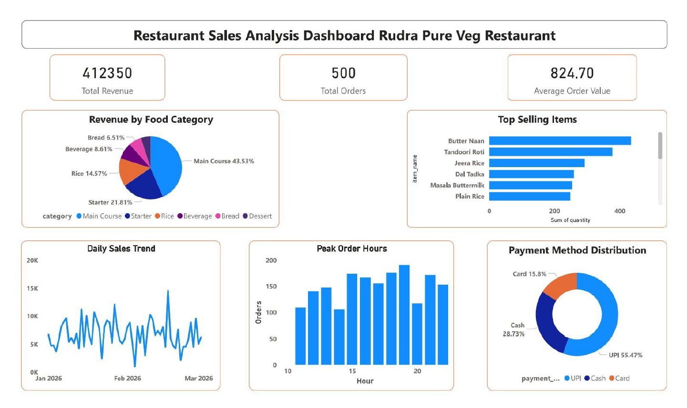

# Restaurant Sales Dashboard

## 📊 Overview

This project analyzes restaurant sales data to understand customer behavior, revenue trends, and operational performance.

## 🛠 Tools Used

* Excel / Power BI

## 📌 Key Features

* Revenue and order tracking
* Customer ordering pattern analysis
* Payment method distribution (UPI, Cash, Card)
* Peak hour identification

## 📈 Insights

* Identified top-selling food items
* Detected peak order hours for better resource planning
* Found dominant payment methods used by customers

## 🎯 Conclusion

The dashboard helps improve sales strategy, customer experience, and operational efficiency.
