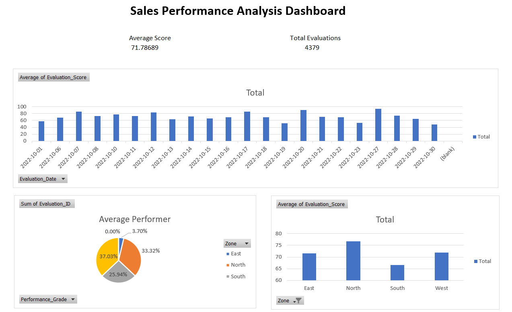

# Sales Performance Analysis Dashboard

## 📊 Overview

This project analyzes sales performance data using Excel to understand trends and insights across regions.

## 🛠 Tools Used

* Microsoft Excel
* Pivot Tables
* Charts

## 📌 Key Features

* Region-wise analysis
* Performance tracking
* Trend visualization

## 📈 Insights

* North region shows highest performance
* South region shows lower performance
* Performance varies across time

## 🎯 Conclusion

This project demonstrates Excel-based data analysis and visualization skills.

